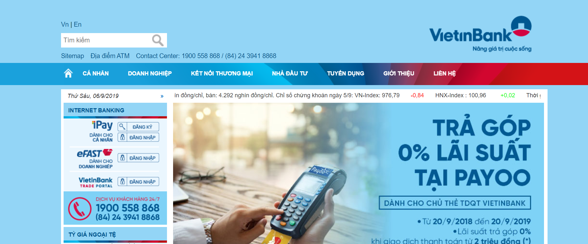

# Phân tích chức năng hệ thống quản lý ngân hàng 

*Lấy ý tưởng từ trang web của ngân hàng Viettinbank.*

## I. Các chức năng chính 
- Login 
- Chuyển tiền 
- Cài đặt 
- Lịch sử 
- Giới thiệu 

### 1. Login 

- Tên đăng nhập 
- Pass
- `Đăng nhập` (button)

*Đăng nhập thành công : thực hiện được các hoạt động tiếp theo*

*Đăng nhập không thành công: Báo sai user hoặc password*

- `Đăng ký` (button)
    - Tên 
    - Ngày tháng năm sinh
    - Số CMND 
    - Địa chỉ
    - SDT 
    - Email 
### 2. Chuyển tiền 

- Nội bộ 
- Khác ngân hàng 

### 3. Lịch sử 

- Tìm kiếm (mã giao dịch,....)
- Số dư 
- Rút tiền 
- Nạp tiền 
 

 ### 4. Cài đặt 

 - Sửa thông tin cá nhân
 - Bảo mật 
    - Khóa giao dịch 
    - Khóa tài khoản 
- Đổi mật khẩu 

### 5. About us 

### II. Cơ sở dữ liệu (SQL management studio 2014)
### III. Sơ đồ chức năng 
### IV. Sơ đồ luồng dữ liệu
### V. Test case

